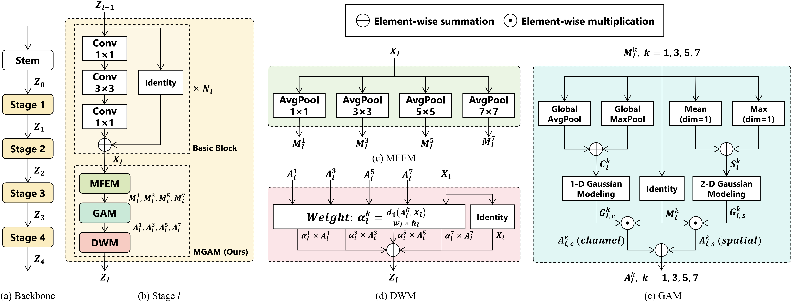

# MGAM
This is the official implementation of the paper "Multiscale Gaussian Attention Mechanism for Tiny-Object Detection in Remote Sensing Images".
## Introduction
MGAM is a novel attention mechanism for tiny object detection in remote sensing images that can be integrated into general object detectors and improve their accuracy without increasing computational overhead.

**Abstract**: Tiny-object detection is increasingly crucial in fields such as remote sensing, traffic monitoring, and robotics. Inspired by human visual perception, the attention mechanism has become a widely used method for enhancing object detection performance. While existing attention mechanisms have significantly advanced general object detection performance, they often fall short in adapting to the characteristics of tiny-object datasets, including huge object size variations and concentrated distributions. In detail, most current attention mechanisms rely on convolutional or linear layers with fixed receptive fields to compute attention vectors. Some methods attempt to enlarge the receptive fields by using multiscale structures, but they often simply sum feature maps, leading to information interference and increased computational costs. To address these issues, we propose a novel multiscale Gaussian attention mechanism (MGAM). This mechanism integrates multiscale receptive fields with dynamic feature weighting and a Gaussian attention module (GAM), replacing traditional convolutional layers to reduce training and inference overhead. In addition, our mechanism can be easily embedded into various detectors without any hyperparameters. Extensive experiments on six object detection datasets demonstrate the effectiveness and robustness of our method.

## Installation
Required environments:

-   Linux
-   Python 3.6+
-   PyTorch 1.3+
-   CUDA 9.2+
-   GCC 5+
-   [MMCV](https://mmcv.readthedocs.io/en/latest/#installation)
-   [cocoapi-aitod](https://github.com/jwwangchn/cocoapi-aitod)

Install:

Note that this repository is based on the [MMDetection](https://github.com/open-mmlab/mmdetection). Assume that your environment has satisfied the above requirements, please follow the following steps for installation.

    git clone https://github.com/cszzshi/MGAM.git
    cd MGAM
    pip install -v -e .

Verify the installation:

To verify whether MMDetection is installed correctly, we provide some sample codes to run an inference demo.

**Step 1.** We need to download config and checkpoint files.

    mim download mmdet --config rtmdet_tiny_8xb32-300e_coco --dest .
  
  **Step 2.** Verify the inference demo.
  
    python demo/image_demo.py demo/demo.jpg rtmdet_tiny_8xb32-300e_coco.py --weights rtmdet_tiny_8xb32-300e_coco_20220902_112414-78e30dcc.pth --device cpu

You will see a new image `demo.jpg` on your `./outputs/vis` folder, where bounding boxes are plotted on cars, benches, etc.

## Get Started

Prepare the dataset:

VisDrone2019 dataset
 - trainset (1.44 GB): [Baidu Yun](https://pan.baidu.com/s/1K-JtLnlHw98UuBDrYJvw3A) | [Google Drive](https://drive.google.com/file/d/1a2oHjcEcwXP8oUF95qiwrqzACb2YlUhn/view?usp=sharing)
 - valset (0.07 GB): [Baidu Yun](https://pan.baidu.com/s/1jdK_dAxRJeF2Xi50IoML1g) | [Google Drive](https://drive.google.com/file/d/1bxK5zgLn0_L8x276eKkuYA_FzwCIjb59/view?usp=sharing)

Train and test:

**Step 1.** Train the model using single GPU.

    python tools/train.py configs/mgam/visdrone/faster-rcnn_r50_fpn_1x_visdrone.py

**Step 2.** Test the trained weight using single GPU.

    python tools/test.py configs/mgam/visdrone/faster-rcnn_r50_fpn_1x_visdrone.py work_dirs/visdrone/faster-rcnn_r50_fpn_1x_visdrone/epoch_12.pth
    
Links of other datasets:

- AI-TOD (22.95 GB):  [Extreme Mart](https://www.cvmart.net/dataSets/detail/361)
- AI-TODv2 (22.95 GB): [Google Drive](https://drive.google.com/drive/folders/1Er14atDO1cBraBD4DSFODZV1x7NHO_PY?usp=sharing)
- SODA-D (24.95GB): [Google Drive](https://nwpueducn-my.sharepoint.com/:f:/g/personal/gcheng_nwpu_edu_cn/EhXUvvPZLRRLnmo0QRmd4YUBvDLGMixS11_Sr6trwJtTrQ?e=PellK6)
- TT100K (18.33GB): [PaddlePaddle](https://aistudio.baidu.com/datasetdetail/209642)
- MS COCO 2017 (19.97GB): [Model Scope](https://www.modelscope.cn/datasets/AI-ModelScope/coco/dataPeview)
